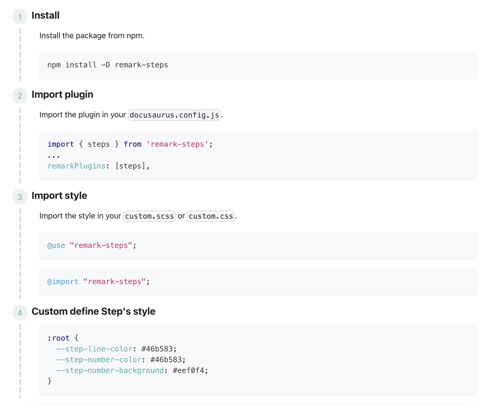

# Remark Steps

Remark plugin to rebuild step style into DOM

## Install

```bash
npm install -D remark-steps
```

## Import

### Import plugin

> docusaurus.config.js

```js
import { steps } from 'remark-steps';
...
remarkPlugins: [steps],

```

### Import style

> support css and scss, you can choose one of them

```scss
// css
@import "remark-steps";

// scss
@import "remark-steps";
```

### Custom define Step's style

> support css and scss, you can choose one of them

```css
:root {
  --step-line-color: #46b583;
  --step-number-color: #46b583;
  --step-number-background: #eef0f4;
}
```

## Usage

> markdown file

````md
:::steps

### Install

Install the package from npm.

```bash
npm install -D remark-steps
```

### Import plugin

Import the plugin in your `docusaurus.config.js`.

```js
import { steps } from 'remark-steps';
...
remarkPlugins: [steps],
```

### Import style

Import the style in your `custom.scss` or `custom.css`.

```css
@use "remark-steps";
```

```css
@import "remark-steps";
```

### Custom define Step's style

```css
:root {
  --step-line-color: #46b583;
  --step-number-color: #46b583;
  --step-number-background: #eef0f4;
}
```

:::
````

> Preview


