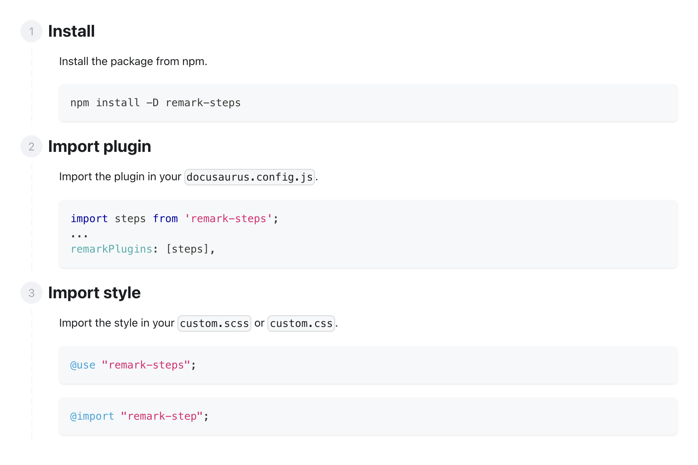

# Remark Step

Remark plugin to rebuild step style into DOM

## Install

```bash
npm install -D remark-step
```

## Import

### Docusaurus

#### Import plugin

> docusaurus.config.js

```js
import remarkStep from 'remark-step';
...
remarkPlugins: [remarkStep],

```

#### Import style

> support css and scss, you can choose one of them

```scss
// css
@import "@litui/remark-step/dist/styles.css";

// scss
@import "@litui/remark-step";
```

#### Define Step's style global variable

> support css and scss, you can choose one of them

```css
:root {
  --step-line-color: var(--ifm-color-secondary-lighter);
  --step-number-color: var(--ifm-color-secondary-darkest);
  --step-number-background: var(--ifm-color-secondary-lighter);
}
```

## Usage

> markdown file

````md
:::steps

### Install

Install the package from npm.

```bash
npm install -D remark-step
```

### Import plugin

Import the plugin in your `docusaurus.config.js`.

```js
import remarkStep from 'remark-step';
...
remarkPlugins: [remarkStep],
```

### Import style

Import the style in your `custom.scss`.

```scss
@use "remark-step";
```

:::
````

> Preview


